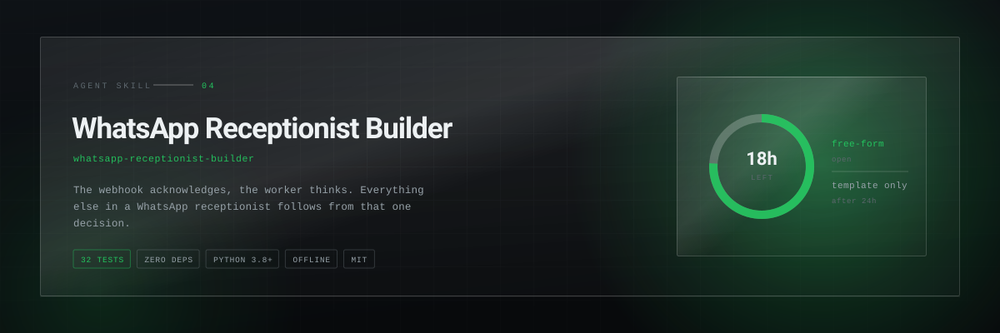
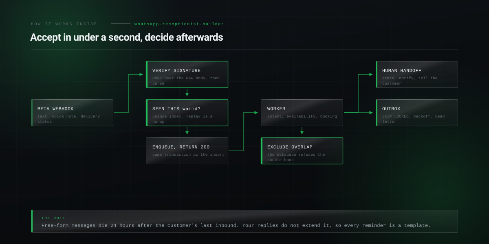

<p align="center">
  <picture>
    <source media="(prefers-color-scheme: dark)" srcset="assets/hero-dark.svg">
    <source media="(prefers-color-scheme: light)" srcset="assets/hero-light.svg">
    
  </picture>
</p>

<h1 align="center">WhatsApp Receptionist Builder</h1>

<p align="center"><b>Build an AI receptionist on the WhatsApp Cloud API that books real appointments: webhook signature over the raw body, the 24-hour customer service window, idempotency against Meta retries, and double-booking prevention at the database.</b></p>

<p align="center">
<a href="LICENSE"></a>
  
  
  
  
</p>

<p align="center">
  <code>npx skills add Hiberius/whatsapp-receptionist-builder</code>
</p>

<p align="center">
  <sub>Works with Claude Code, Claude Desktop, Codex, Cursor, Windsurf, OpenClaw and
  anything else that reads a <code>SKILL.md</code>.</sub>
</p>

---


## The four traps

**1. The signature is over the raw body.** Parse the JSON before verifying and the digest
never matches. It presents as a wrong secret, and it is not.

**2. The 24-hour window closes on the customer's last message.** Your replies do not
extend it. Every reminder and follow-up you send on a schedule is outside it by
definition, so it must be a template approved in advance.

**3. Meta retries.** On timeouts too. Without an idempotency table on the message id, one
customer gets two answers and, if the first one booked, two appointments.

**4. Double booking is a race.** Two requests read the same free slot in the same
millisecond. No application-level check wins that; a database exclusion constraint does.

## What it does

| Command | What you get |
|---|---|
| `signature` | Computes or verifies `X-Hub-Signature-256` exactly as Meta does, over the raw bytes |
| `window` | Whether you may send free-form or need an approved template, and how long you have |
| `payload` | Realistic webhook bodies: text, voice note, image, button, delivery status. Reuse a `wamid` and you have an idempotency test |


## How it works inside

<p align="center">
  <picture>
    <source media="(prefers-color-scheme: dark)" srcset="assets/diagram-dark.svg">
    <source media="(prefers-color-scheme: light)" srcset="assets/diagram-light.svg">
    
  </picture>
</p>


## Tools that work without a phone number

```bash
python3 scripts/wa.py window --last-inbound 2026-09-08T09:12:00Z
```

```
window closes  2026-09-09T09:12:00+00:00
state          OPEN
remaining      18h 12m
you may send   free-form
```

```bash
python3 scripts/wa.py payload audio --from 393331234567 > voice.json

curl -X POST localhost:3000/api/webhook/whatsapp \
  -H "X-Hub-Signature-256: $(python3 scripts/wa.py signature --secret "$APP_SECRET" --body-file voice.json)" \
  --data-binary @voice.json
```

`--data-binary` matters: `-d` mangles newlines and the signature stops matching.

## Double booking is a race, so the database has to say no

```sql
CREATE EXTENSION IF NOT EXISTS btree_gist;
ALTER TABLE appointments ADD CONSTRAINT no_overlap
  EXCLUDE USING gist (
    resource_id WITH =,
    tstzrange(starts_at, ends_at) WITH &&
  ) WHERE (status <> 'cancelled');
```

Then treat the violation as a normal outcome: apologise, offer the next slot. Under real
load it fires regularly and the customer should never see a stack trace.

## A working implementation

[whatsapp-receptionist](https://github.com/Hiberius/whatsapp-receptionist) is the full
thing: Next.js, Supabase, multi-tenant, GDPR-first, 544 unit tests and 56 E2E tests, MIT.
This skill is the reasoning behind it, usable on any stack.

## Not for

Marketing broadcasts, unofficial WhatsApp clients, or scraping. Those get numbers banned.
The Cloud API is the only path that survives contact with a real business.


## Documentation

- [`SKILL.md`](SKILL.md) — the skill itself, what the agent reads
- [`references/architecture.md`](references/architecture.md) — webhook, idempotency, outbox, retries, escalation, what to monitor
- [`references/whatsapp-api-traps.md`](references/whatsapp-api-traps.md) — the window, templates, media ids, opt-out, quality rating, delivery statuses
- [`references/booking-correctness.md`](references/booking-correctness.md) — the exclusion constraint, availability subtraction, timezones and DST, Google Calendar
- [`references/gdpr-and-data.md`](references/gdpr-and-data.md) — retention, PII redaction, Art. 15 and 17, tenant isolation, credentials


## Related skills

- **[ad-comment-moderation](https://github.com/Hiberius/ad-comment-moderation)** — the other half of a Meta presence: what happens under the ad
- **[always-on-agent](https://github.com/Hiberius/always-on-agent)** — the same queue and approval thinking, on your own machine
- **[invisible-text-forensics](https://github.com/Hiberius/invisible-text-forensics)** — an inbound message is attacker-controlled text

All ten in one install:

```
/plugin marketplace add Hiberius/hiberius-skills
```


## Work with me

I build the systems these skills came out of: performance marketing infrastructure,
lead pipelines, ad account tooling, internal automation, and products on the Cloudflare
edge stack. If you need something like this built properly, I take on freelance and
contract work.

**[Christian Calabro — github.com/Hiberius](https://github.com/Hiberius)**

Performance marketing · media buying · TypeScript · Cloudflare Workers · Next.js · Python

---

## Contributing

Issues and pull requests welcome. The rule for a change to the skill itself: it has to
be something you learned by getting it wrong once, not something you read in the docs.

## License

MIT. No network calls, no telemetry, no dependencies.
